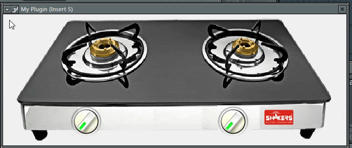

# Stove VST dengan Delphi 7

Proyek ini adalah plugin VST sederhana yang dikembangkan menggunakan Delphi 7, yang disebut "Stove". Plugin ini memungkinkan Anda untuk menambahkan efek suara ke dalam lingkungan Digital Audio Workstation (DAW) Anda.

## Fitur

- **Dua Knob Kontrol**: Plugin ini dilengkapi dengan dua knob kontrol yang dapat disesuaikan.
- **Antarmuka Pengguna Sederhana**: Antarmuka pengguna yang mudah digunakan untuk mengendalikan efek suara.

## Persyaratan

- Delphi 7 atau versi yang lebih tinggi.
- DAW yang mendukung plugin VST untuk menguji dan menggunakan plugin ini.

## Penggunaan

1. Buka proyek dalam Delphi 7.
2. Kompilasi proyek untuk menghasilkan file plugin VST.
3. Pasang plugin VST ke dalam folder yang sesuai di DAW Anda.
4. Buka DAW Anda dan tambahkan "Stove" sebagai efek suara di jalur audio.
5. Gunakan dua knob kontrol untuk mengubah karakteristik suara yang dihasilkan oleh plugin.

## Kontribusi

Kami sangat menghargai kontribusi Anda untuk proyek ini. Jika Anda ingin berkontribusi, silakan buat _pull request_ dan kami akan mempertimbangkan untuk menggabungkannya.

## Lisensi

Proyek ini dilisensikan di bawah lisensi MIT. Lihat [LISENSI](LISENSI.md) untuk informasi lebih lanjut.

## Dukungan

Jika Anda memiliki pertanyaan atau masalah terkait proyek ini, silakan buka _issue_ di repositori ini atau hubungi kami melalui [email@example.com](mailto:email@example.com).

Terima kasih telah menggunakan plugin VST "Stove" Delphi 7!

